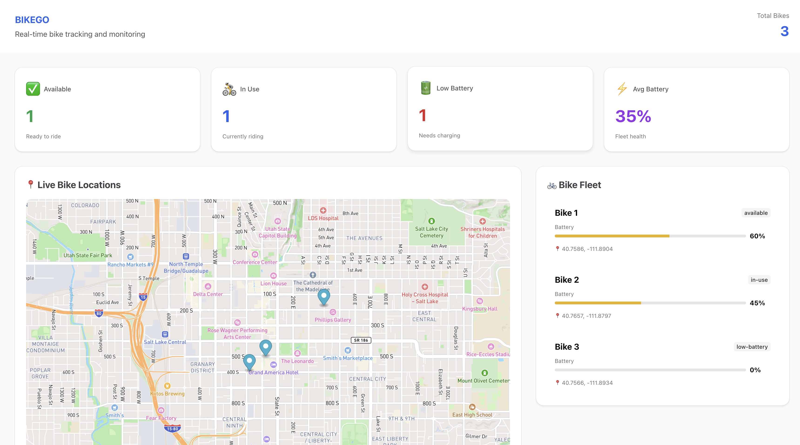

# 🚴‍♀️ Bike Tracker App

An interactive web app built with **React**, **TypeScript**, and **Mapbox** to help users track and visualize their bike routes.  
Developed with the help of **Amp**, Sourcegraph’s AI coding agent, this project strengthened my skills in building map-based applications, integrating APIs, and writing clean, type-safe code.

---

## 🔗 Live Demo
[👉 View the Live Demo](https://bikego-biketracker.netlify.app/)

---

## 📸 Preview
  


---

## 🗺️ Features
- 🧭 **Track and visualize** bike routes on an interactive Mapbox map    
- ⚡ **Fast development setup** using Vite  
- 🧠 **Type-safe code** with TypeScript  
- 🤖 **AI-assisted development** with Amp for real-time coding support  
- 📱 **Responsive design** for both desktop and mobile  

---

## 🚀 Tech Stack
- **React + TypeScript + Vite** – modern, fast, and type-safe frontend development  
- **Mapbox GL JS** – for interactive, real-time map rendering  
- **ESLint + Prettier** – ensures clean and consistent code  
- **Amp (by Sourcegraph)** – for AI-assisted coding in VS Code  

---

## ⚙️ Getting Started

Follow these steps to set up and run the project locally.

### 1. Clone the repository
```bash
git clone https://github.com/your-username/bike-tracker-app.git
cd bike-tracker-app
```

### 2. Install dependencies
```bash
npm install
```

### 3. Set up environment variables  
Create a `.env` file in the project root and add your Mapbox token:
```bash
VITE_MAPBOX_ACCESS_TOKEN=your_mapbox_token_here
```

### 4. Run the development server
```bash
npm run dev
```

Then open [http://localhost:5173](http://localhost:5173) in your browser.

---

## 🧩 Configuration

This project uses **Vite** with Hot Module Replacement (HMR) and a base **ESLint** setup.  
You can expand it with stricter TypeScript or React rules for production use.

### TypeScript Type-Aware Linting
Update your `eslint.config.js` file:
```js
tseslint.configs.strictTypeChecked
```

### React-Specific Lint Rules
Install additional linting plugins:
```bash
npm install eslint-plugin-react-x eslint-plugin-react-dom
```

Then extend your ESLint configuration:
```js
import reactX from 'eslint-plugin-react-x'
import reactDom from 'eslint-plugin-react-dom'

export default defineConfig([
  globalIgnores(['dist']),
  {
    files: ['**/*.{ts,tsx}'],
    extends: [
      reactX.configs['recommended-typescript'],
      reactDom.configs.recommended,
    ],
  },
])
```

---

## 🧠 What I Learned
- Integrating **Mapbox** with React for dynamic route visualization  
- Managing state and user interactions in **React**  
- Applying **TypeScript** for clean, scalable, and reliable code  
- Configuring **Vite** for optimal development performance  
- Using **Amp** for AI-assisted coding and collaboration  

---

## 💡 Future Improvements
- Add user authentication for personal route tracking  
- Save and load routes from a database  
- Display total distance and duration  
- Add route sharing and social features  
- Expand mobile support and offline mode  

---

## 🤝 Contributing
Contributions are welcome!  
If you’d like to improve the project:
1. Fork this repository  
2. Create a new branch (`git checkout -b feature/your-feature`)  
3. Commit your changes (`git commit -m 'Add new feature'`)  
4. Push to the branch (`git push origin feature/your-feature`)  
5. Open a Pull Request  

---

## 🪄 Credits
Developed by **Lesliee Cruz**  
Powered by **React**, **TypeScript**, **Vite**, **Mapbox**, and **Amp (Sourcegraph)**  

---

## 📜 License
This project is open source and available under the [MIT License](LICENSE).
